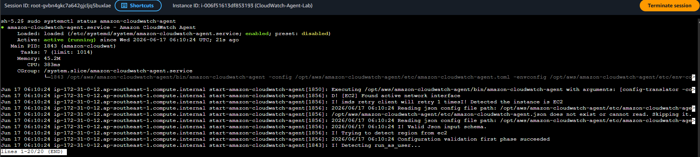
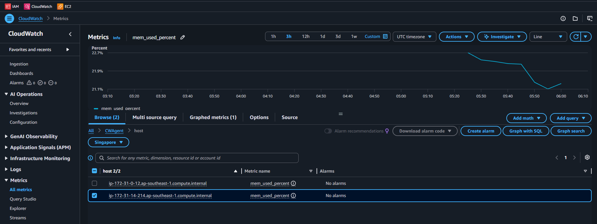

**Check 1: Verify the Agent is Active on the Instance**
- Open the Amazon EC2 Console.
- Click on Instances and select your CloudWatch-Agent-Lab server.
- Click the Connect button at the top.
- Choose the Session Manager tab and click Connect to open a terminal inside your browser.
- Run the following command to see if the agent is actively running

	`sudo systemctl status amazon-cloudwatch-agent`

	

**Check 2: View Metrics in CloudWatch**

Because memory and disk metrics are custom OS-level metrics, they do not appear in the standard EC2 dashboard. They live in a special area.
- Open the Amazon CloudWatch Console.
- In the left-hand menu, navigate to Metrics > All metrics.
- There is a new category named CWAgent under the Custom namespaces section
- Click on CWAgent, then choose host.
- Check the boxes next to them to see your live data stream on the chart (metric: mem_used_percent)

    