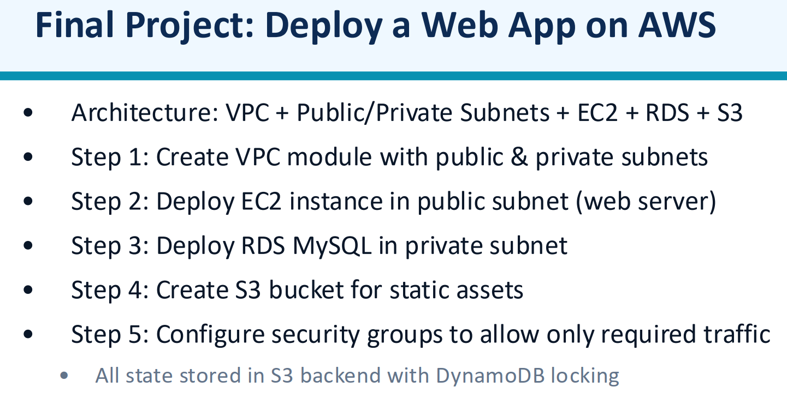
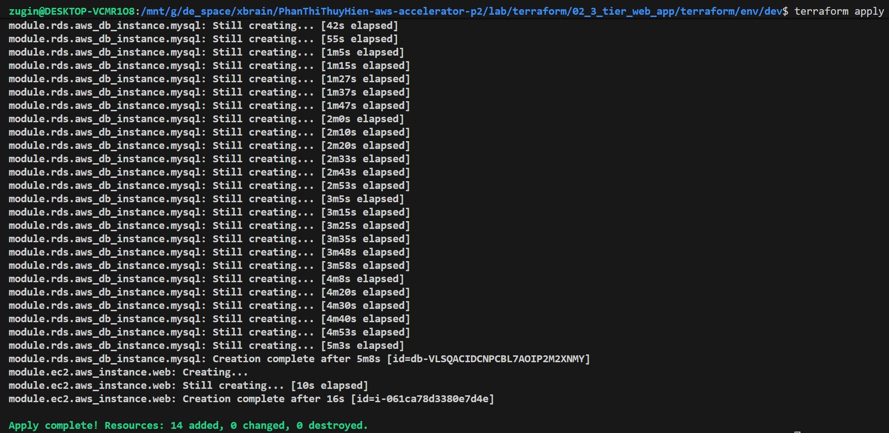
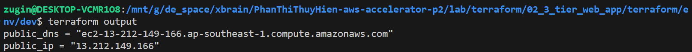
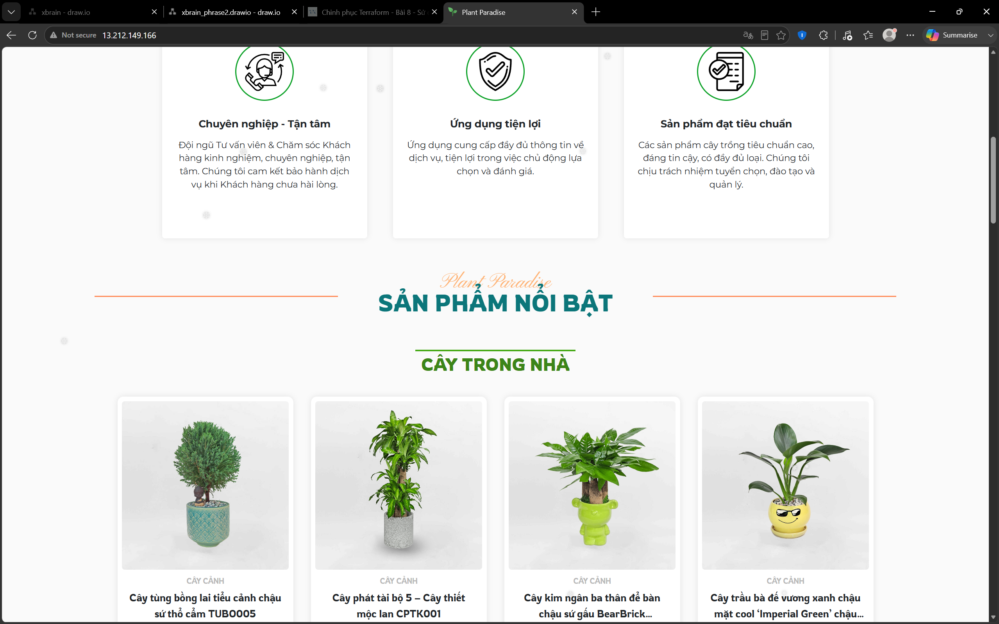
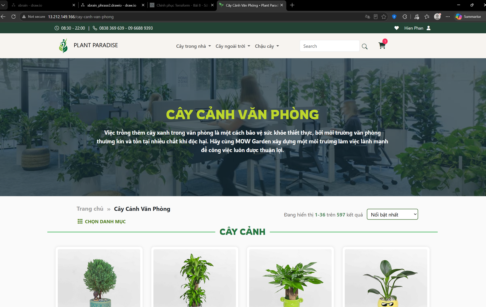
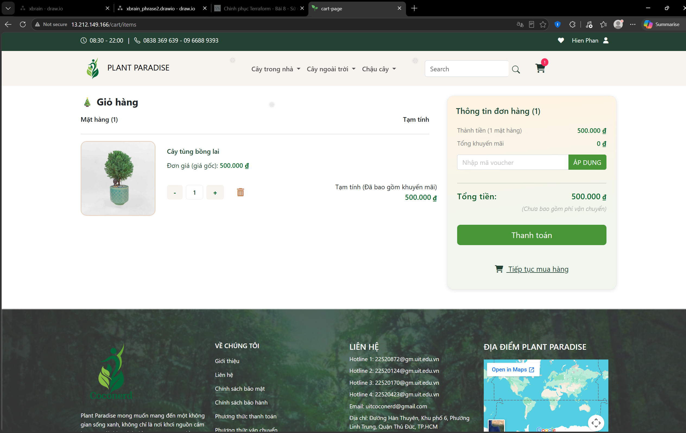

## Requirement

# How to run

- Run: \
  `terraform plan` \
  `terraform apply -var-file=terraform.tfvars -input=false`
  
- Then get the website address: `terraform output public_ip`
  
- Open: **http://<public_ip>**
  
  
  
- Destroy all managed resources: \
  `terraform destroy -var-file=terraform.tfvars -auto-approve`
