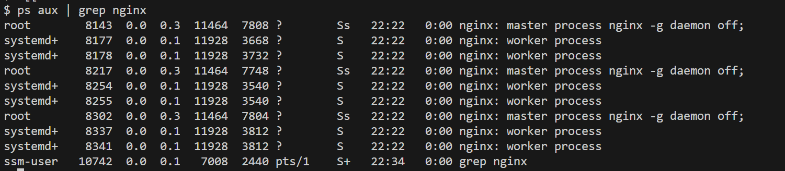
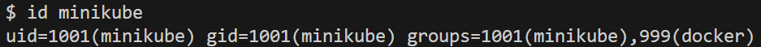
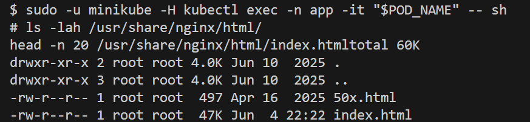
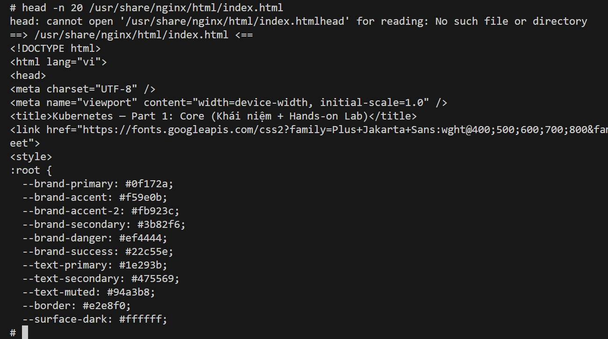

Terraform output values:

## Ensure the simple application is running in Kuberneters Pod, not in EC2

ps aux | grep nginx

Check user **minikube** in EC2
1. aws ssm start-session --target i-052ada0ef36eca860
2. id minikube

3. View Pod in Kubernetes: sudo -u minikube -H kubectl get pods -n app -o wide

4. Pick 1 Pod

POD_NAME=$(sudo -u minikube -H kubectl get pod -n app -l app=simple-app -o jsonpath='{.items[0].metadata.name}') \
echo $POD_NAME$

5. Exec this Pod

sudo -u minikube -H kubectl exec -n app -it "$POD_NAME" -- sh

