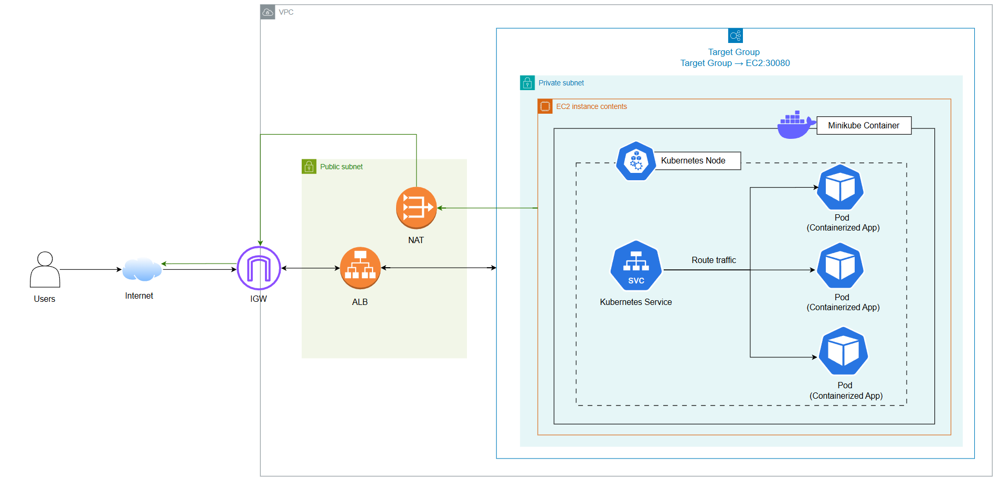
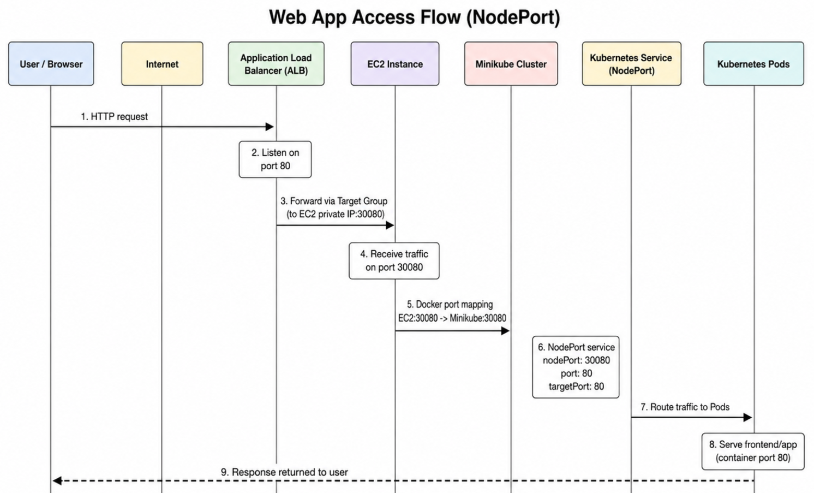
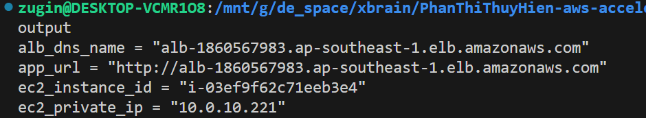
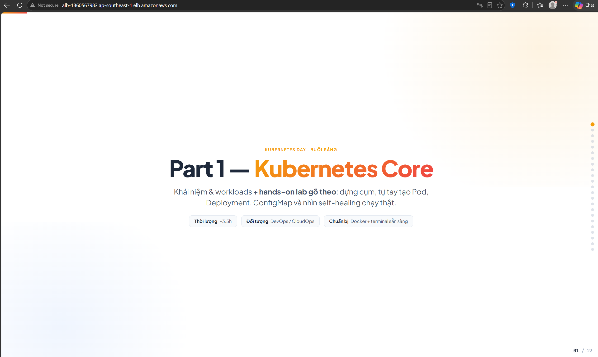
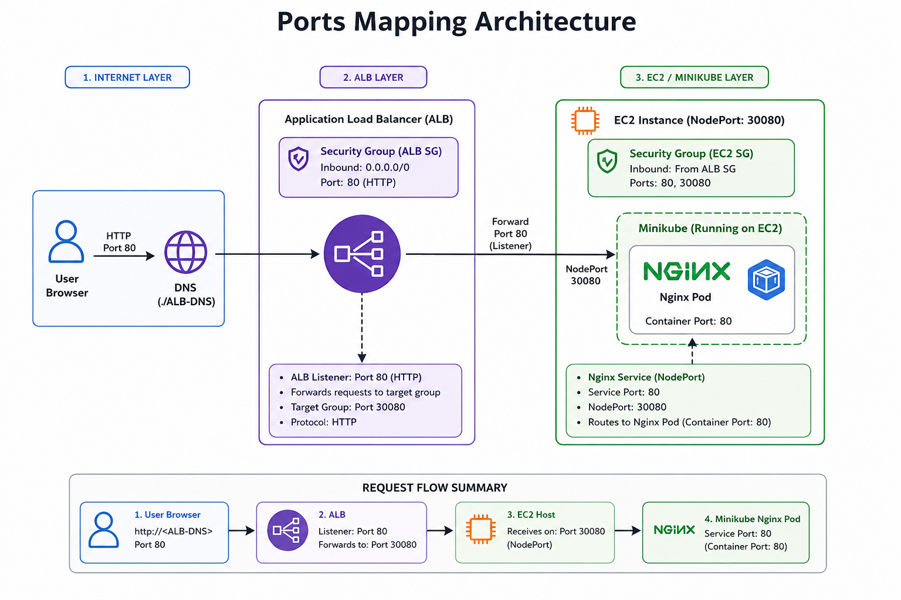
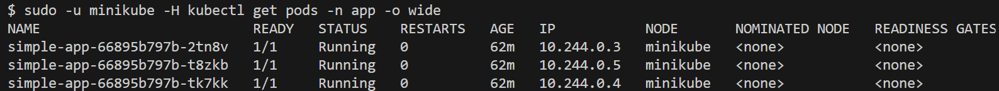
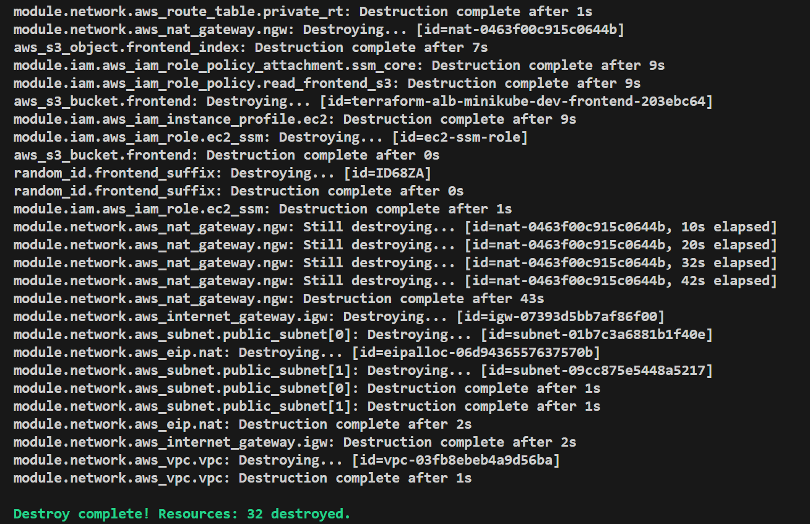

## Proposed Architecture



## Sequence Diagram



## Result




## Used Providers

This project uses the following Terraform providers:

- `hashicorp/aws` (~> 5.0)
  - Primary provider for all AWS resources in the architecture.
  - Creates the VPC, public/private subnets, security groups, IAM role/profile, EC2 instance, S3 bucket/object, and Application Load Balancer.

- `hashicorp/cloudinit` (~> 2.3)
  - Generates the EC2 `user_data` payload in a proper cloud-init format.
  - Used by the compute module to bootstrap the EC2 instance with Docker, Minikube, kubectl, and frontend deployment logic.

- `hashicorp/random` (~> 3.6)
  - Generates a unique suffix for the frontend S3 bucket name.
  - Ensures the bucket name is globally unique while still following the project/environment naming pattern.

## EC2 User Data Script

`user_data.sh` plays an important role in the project, helping us automate bootstraping tasks like software installation, updates, and configuration. So what does the file handle in detail?

1. Update system packages
2. Download frontend file from S3 and save it in EC2 instance
   ```bash
   aws s3 cp "s3://$${FRONTEND_BUCKET}/$${FRONTEND_KEY}" /tmp/index.html
   ```
3. Install Docker
4. Create minikube user, install kubectl and minikube
5. Run minikube through **Docker Driver**
   ```bash
   minikube start --driver=docker \
      --container-runtime=docker
      --cpus=2
      --memory=1800mb
      --ports=$${NODE_PORT}:$${NODE_PORT}
   ```
6. Create frontend **ConfigMap** which is an API object used to store non-confidential configuration data in key-value pairs in Kubernetes

   ```bash
   kubectl create configmap frontend-html \
     --from-file=index.html=/tmp/index.html \
     -n app \
     --dry-run=client \
     -o yaml | kubectl apply -f -
   ```

   The ConfigMap will look like this:

   ```yaml
   apiVersion: v1
   kind: ConfigMap
   metadata:
      name: frontend-html
   data:
      index.html: |
         <!DOCTYPE html>
         <html>
      ...
   ```

7. Create **Kubernetes Deployment to run frontend app** using Nginx container
   - Run Nginx container
   - Mount index.html from ConfigMap
   - Expost container on port 80
   - Create Pod instances based on APP_REPLICAS
8. Create **Kubernetes Service** having the important configuration "**spec type is NodePort**". This means Kubernetes will open a fixed port on Kubernetes Node to allow outbound traffics

## Deep dive into ports mapping

This project maps traffic through three main port layers:

1. Internet → ALB on port `80`
   - The public Application Load Balancer listens on HTTP port `80`.
   - The ALB security group allows inbound traffic from `0.0.0.0/0` to port `80`.

2. ALB → EC2 instance on NodePort `30080`
   - The ALB target group forwards requests to the EC2 instance on port `30080`.
   - The ALB listener is configured on port `80` and forwards to the target group port `30080`.
   - The ALB security group also allows outbound TCP traffic to `30080`.

3. EC2/Minikube → Nginx container port `80`
   - Inside Minikube, the Kubernetes Service is exposed as `NodePort` `30080`.
   - The frontend Nginx pod listens on container port `80` and is accessible via the node port on the EC2 host.
   - `user_data.sh` starts Minikube with `--ports=$${NODE_PORT}:$${NODE_PORT}` so the EC2 host port `30080` is mapped correctly into the Minikube node.



## Check Pods

1. `aws ssm start-session --target i-03ef9f62c71eeb3e4`

2. View Pod in Kubernetes: `sudo -u minikube -H kubectl get pods -n app -o wide`
   

## Tear down all services


